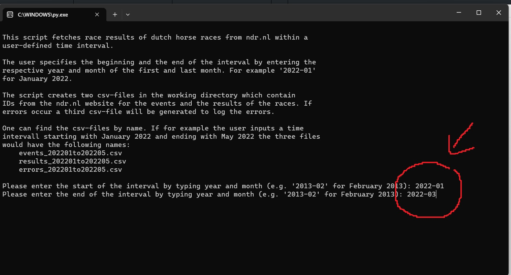
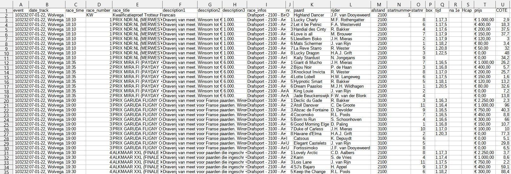

# draf-ndr-scraper

## A project written in Python to help you downloading dutch horse racing results
Have you ever thought about having all the dutch harness racing results from [ndr.nl](https://ndr.nl/) since 1995 stored on your computer to analyse them? Probably not. But this project helps you downloading them anyway.

You need Chrome 116 to fit the chromedriver.exe in this repository. Or just substiute the chromedriver.exe with the one which fits your Chrome version. 


## Usage
```
> python ndr_scraper.py
```
Then you just have to enter the starting year and month with '-' between them (e.g. '2022-01'). And after that the last year and month of the time period for which you would like to download the results. 



And please don't go overboard with the length of the time interval because the scraper is a little bit slow. I just wanted a simple, robust and easy to maintain solution to this problem.

The script will then start the Chrome browser to fetch some IDs from ndr.nl (could have done it headless, but I did not want to). After that two csv files are going to be created.
One with the event IDs from ndr.nl and one with the race results. In case of any errors (e.g. no tables for an event) a third file will be created which logs the errors.

A header will be created in the csv file with the results. Please keep this in mind when combining several result-files.

#### Example of the Results File


And I think I should add something like "Please scrape responsibly".

